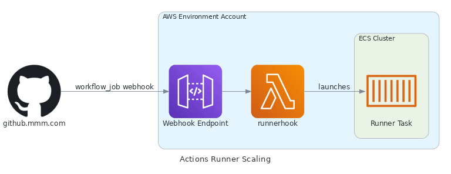

# GitHub Enterprise Actions Runners

## Overview

This repository will create a pipeline to launch [self-hosted Github Action Runners](https://docs.github.com/en/actions/hosting-your-own-runners/about-self-hosted-runners) for 3M's [Github Enterprise](https://github.mmm.com).

This runner DOES NOT enable docker tasks. That would require docker-in-docker functionality which is not enabled on Fargate.
See: aws-containers-roadmap <https://github.com/aws/containers-roadmap/issues/1356>

Below is a description of notable resources deployed by the pipeline:

| Resource   | Description          | Stack     |
| ---------- | -------------------- | ----------|
| API Gateway | Accepts the webhook from GitHub enterprise and triggers the lambda. | Serverless.yml |
| VPC Endpoint| Endpoint for the API Gateway | Serverless.yml |
| ECS runner task definition | Contains the configuration for the ECS Fargate runner | Serverless.yml |
| Lambda  | Starts the runner using the task definition. | Serverless.yml |
| `namespace`GitToken secret | Secrets manager secret to store the access token used for registering the webhook to the repo | Secrets.yml |
| `namespace`HookSecret secret | Secrets manager secret to store the random string used to secure the webhook communication. This is generated for you. | Secrets.yml |

## Configuration

This pipeline requires configuration in the account where you will be deploying the runners.

### Networking Connectivity
    The networking team needs to enable connectivity from GitHub enterprise to the account and VPC where the API gateway endpoint will be deployed. By default, the API gateway endpoint is deployed to the routable subnets.
    To request this access, open an HISHOST `task` Jira ticket and provide the routable VPC and subnet IDs in the ticket.
### Runner target
    The runners can respond to jobs from a specific repository or all repositories in a given organization. Set the `runner_target` value for the environment in [blackbird_config.yml](blackbird_config.yml) to the organization name or the specific repository (e.g `myorg\testteam-pipeline`). The pipeline automatically registers a webhook in the target
    when the environment is deployed using the `worflow_job` trigger (https://docs.github.com/en/developers/webhooks-and-events/webhooks/webhook-events-and-payloads#workflow_job). By default, this is set to the pipeline repo for this pipeline.
### Runner labels
    The runners will respond to jobs when the labels on the job match the runner's  labels (See [Using Labels](https://docs.github.com/en/actions/hosting-your-own-runners/using-labels-with-self-hosted-runners)). Runner labels can be configured using `runner_labels` list in [blackbird_config.yml](blackbird_config.yml) for each environment. By default, the labels applied are `self-hosted,linux`.
### Github Access Token
    The solution requires a Github API token to communicate with the API to register the runners and configure the webhook. For organization targets, the token will need organization admin (`admin:org` scope) and repo admin permissions (`repo` scope). For repo targets, the token will need repo admin permissions (`repo` scope). To create the token, see [Create a PAT](https://docs.github.com/en/authentication/keeping-your-account-and-data-secure/creating-a-personal-access-token).

    Update the Secrets Manager secret with the created token. The secret name is `'namespace'GitToken`. Note that you must run the pipeline through the environment FoundationalStacks step before the secret is created. When updating the secret, be sure you set it using the key/value configuration with 'token' as the secret key and the GitHub access token as the secret value.
### Github Webhook Secret
    When the pipeline is deployed, it generates a random secret which is used to [secure the Github Webhook](https://docs.github.com/en/developers/webhooks-and-events/webhooks/securing-your-webhooks). This is stored in AWS Secrets Manager in the deployment account under the name `'namespace'HookSecret`. You can rotate the token as needed by updating the secret in secrets manager and executing the pipeline to sync the webhook configuration.

## Architecture

Action runners are launched by integrating with Github's [workflow_job webhook](https://docs.github.com/en/developers/webhooks-and-events/webhooks/webhook-events-and-payloads#workflow_job). When a new job is queued, Github invokes a API Gateway in the deployment account and passes the request the [runnerhook](runnerhook/handler.py) lambda function. The lambda function generates a [runner registration token](https://docs.github.com/en/rest/actions/self-hosted-runners#create-a-registration-token-for-a-repository) and launches an ECS fargate task. The task registers with Github and executes the Actions job. When the job is finished, the runner deregisters.

The webhook configuration is automatically created and updated with the pipeline.

## Runner Environment

The runners execute within ECS Fargate as docker containers. This *DOES NOT* enable docker tasks. That would require docker-in-docker functionality which is not enabled on [Fargate](https://github.com/aws/containers-roadmap/issues/1356).

### OS
The OS and related packages are controlled by the [Dockerfile](app/Dockerfile.ubuntu) which is used to build the runner image. By default, this image is based on Ubuntu 22.04 LTS. Minimal packages are installed by default, but sudo permissions are available which mirrors the standard Github Virtual Environments.

Use official actions to configure required runtimes (e.g [setup-python](https://github.com/actions/setup-python)) where possible. This increases the portability of your runner image across multiple repos and mirrors how commercial Github Runners would be used.

### Security
The runners have minimal AWS permissions that are controlled by the IAM role assigned to the ECS task. You can view and configure the `EcsTaskRole` in the [Roles template](CloudFormation/Roles.jinja.yml).
It is recommended that you regularly change the access token that is used for registering the webhook. You should also regularly deploy the pipeline to update the docker image with the latest security patches.

## Setting up workflows

The Blackbird team has created workflows for various tasks that can be used in a Blackbird pipeline that can be accessed here: https://github.mmm.com/blackbird/blackbird-actions-workflow. This repo will be updated regularly and we welcome contributers.
<!-- BEGIN_TF_DOCS -->
## Requirements

No requirements.

## Providers

| Name | Version |
|------|---------|
|  [archive](#provider\_archive) | 2.5.0 |
|  [aws](#provider\_aws) | 5.65.0 |
|  [random](#provider\_random) | 3.6.2 |

## Modules

| Name | Source | Version |
|------|--------|---------|
|  [files](#module\_files) | HappyPathway/files/ls | n/a |

## Resources

| Name | Type |
|------|------|
| [archive_file.runnerhook](https://registry.terraform.io/providers/hashicorp/archive/latest/docs/resources/file) | resource |
| [aws_apigatewayv2_api.hook_api](https://registry.terraform.io/providers/hashicorp/aws/latest/docs/resources/apigatewayv2_api) | resource |
| [aws_cloudwatch_log_group.access_log_group](https://registry.terraform.io/providers/hashicorp/aws/latest/docs/resources/cloudwatch_log_group) | resource |
| [aws_cloudwatch_log_group.function_log_group](https://registry.terraform.io/providers/hashicorp/aws/latest/docs/resources/cloudwatch_log_group) | resource |
| [aws_cloudwatch_log_group.log_group](https://registry.terraform.io/providers/hashicorp/aws/latest/docs/resources/cloudwatch_log_group) | resource |
| [aws_ecs_task_definition.runner_task_definition](https://registry.terraform.io/providers/hashicorp/aws/latest/docs/resources/ecs_task_definition) | resource |
| [aws_iam_role.ecs_task_execution_role](https://registry.terraform.io/providers/hashicorp/aws/latest/docs/resources/iam_role) | resource |
| [aws_iam_role.ecs_task_role](https://registry.terraform.io/providers/hashicorp/aws/latest/docs/resources/iam_role) | resource |
| [aws_iam_role.runner_hook_role](https://registry.terraform.io/providers/hashicorp/aws/latest/docs/resources/iam_role) | resource |
| [aws_lambda_function.function](https://registry.terraform.io/providers/hashicorp/aws/latest/docs/resources/lambda_function) | resource |
| [aws_secretsmanager_secret.git_access_token](https://registry.terraform.io/providers/hashicorp/aws/latest/docs/resources/secretsmanager_secret) | resource |
| [aws_secretsmanager_secret.git_hook_secret](https://registry.terraform.io/providers/hashicorp/aws/latest/docs/resources/secretsmanager_secret) | resource |
| [aws_secretsmanager_secret_version.git_access_token_version](https://registry.terraform.io/providers/hashicorp/aws/latest/docs/resources/secretsmanager_secret_version) | resource |
| [aws_secretsmanager_secret_version.git_hook_secret_version](https://registry.terraform.io/providers/hashicorp/aws/latest/docs/resources/secretsmanager_secret_version) | resource |
| [aws_security_group.container_security_group](https://registry.terraform.io/providers/hashicorp/aws/latest/docs/resources/security_group) | resource |
| [aws_security_group.serverless_security_group](https://registry.terraform.io/providers/hashicorp/aws/latest/docs/resources/security_group) | resource |
| [aws_security_group.vpce_security_group](https://registry.terraform.io/providers/hashicorp/aws/latest/docs/resources/security_group) | resource |
| [aws_security_group_rule.container_security_group_egress](https://registry.terraform.io/providers/hashicorp/aws/latest/docs/resources/security_group_rule) | resource |
| [aws_security_group_rule.serverless_security_group_egress](https://registry.terraform.io/providers/hashicorp/aws/latest/docs/resources/security_group_rule) | resource |
| [aws_security_group_rule.vpce_security_group_egress](https://registry.terraform.io/providers/hashicorp/aws/latest/docs/resources/security_group_rule) | resource |
| [aws_security_group_rule.vpce_security_group_ingress](https://registry.terraform.io/providers/hashicorp/aws/latest/docs/resources/security_group_rule) | resource |
| [aws_ssm_parameter.hook_url_ssm_parameter](https://registry.terraform.io/providers/hashicorp/aws/latest/docs/resources/ssm_parameter) | resource |
| [aws_vpc_endpoint.vpc_endpoint](https://registry.terraform.io/providers/hashicorp/aws/latest/docs/resources/vpc_endpoint) | resource |
| [random_password.git_access_token_password](https://registry.terraform.io/providers/hashicorp/random/latest/docs/resources/password) | resource |
| [random_password.git_hook_secret_password](https://registry.terraform.io/providers/hashicorp/random/latest/docs/resources/password) | resource |
| [aws_caller_identity.current](https://registry.terraform.io/providers/hashicorp/aws/latest/docs/data-sources/caller_identity) | data source |
| [aws_partition.current](https://registry.terraform.io/providers/hashicorp/aws/latest/docs/data-sources/partition) | data source |
| [aws_region.current](https://registry.terraform.io/providers/hashicorp/aws/latest/docs/data-sources/region) | data source |

## Inputs

| Name | Description | Type | Default | Required |
|------|-------------|------|---------|:--------:|
|  [container\_security\_group](#input\_container\_security\_group) | Security group to apply to containers | `string` | n/a | yes |
|  [ecs\_cluster](#input\_ecs\_cluster) | Cluster used to create and execute tasks | `string` | n/a | yes |
|  [ecs\_task\_execution\_role\_arn](#input\_ecs\_task\_execution\_role\_arn) | ARN for role to execute tasks in ECS | `string` | n/a | yes |
|  [ecs\_task\_role\_arn](#input\_ecs\_task\_role\_arn) | ARN for role to create tasks in ECS | `string` | n/a | yes |
|  [environment](#input\_environment) | Name of the AWS deployment environment | `string` | n/a | yes |
|  [git\_hook\_secret](#input\_git\_hook\_secret) | Secret for GithubHook | `string` | n/a | yes |
|  [github\_secret\_arn](#input\_github\_secret\_arn) | Secret ARN of PAT for github actions | `string` | n/a | yes |
|  [hook\_secret\_arn](#input\_hook\_secret\_arn) | Secret ARN of PAT for github actions | `string` | n/a | yes |
|  [image](#input\_image) | The container to run tasks in | `string` | n/a | yes |
|  [island\_subnet\_a](#input\_island\_subnet\_a) | Subnets used for Service Template, passed via foundational.json | `string` | n/a | yes |
|  [island\_subnet\_b](#input\_island\_subnet\_b) | Subnets used for Service Template, passed via foundational.json | `string` | n/a | yes |
|  [log\_group](#input\_log\_group) | Log group for task logging | `string` | n/a | yes |
|  [namespace](#input\_namespace) | Prefix for all resources generated by the pipeline | `string` | n/a | yes |
|  [routable\_subnet\_a](#input\_routable\_subnet\_a) | Subnets used for Service Template, passed via foundational.json | `string` | n/a | yes |
|  [routable\_subnet\_b](#input\_routable\_subnet\_b) | Subnets used for Service Template, passed via foundational.json | `string` | n/a | yes |
|  [runner\_group](#input\_runner\_group) | Name of the runner group | `string` | n/a | yes |
|  [runner\_labels](#input\_runner\_labels) | Comma-separated list of runner labels | `string` | n/a | yes |
|  [serverless\_role\_arn](#input\_serverless\_role\_arn) | Execution role of the lambda function | `string` | n/a | yes |
|  [serverless\_security\_group](#input\_serverless\_security\_group) | Security group to apply to lambda | `string` | n/a | yes |
|  [ssi\_prefix](#input\_ssi\_prefix) | Prefix used for resources needing boundary permissions | `string` | n/a | yes |
|  [tag](#input\_tag) | Used as the aws log stream prefix | `string` | n/a | yes |
|  [vpc\_id](#input\_vpc\_id) | VPC ID to build in | `string` | n/a | yes |
|  [vpce\_security\_group](#input\_vpce\_security\_group) | Security group to apply to vpc endpoint | `string` | n/a | yes |

## Outputs

| Name | Description |
|------|-------------|
|  [access\_log\_group\_arn](#output\_access\_log\_group\_arn) | n/a |
|  [container\_security\_group](#output\_container\_security\_group) | n/a |
|  [ecs\_task\_execution\_role\_arn](#output\_ecs\_task\_execution\_role\_arn) | n/a |
|  [ecs\_task\_role\_arn](#output\_ecs\_task\_role\_arn) | n/a |
|  [function\_log\_group](#output\_function\_log\_group) | n/a |
|  [function\_name](#output\_function\_name) | n/a |
|  [git\_access\_token](#output\_git\_access\_token) | n/a |
|  [git\_hook\_secret](#output\_git\_hook\_secret) | n/a |
|  [log\_group](#output\_log\_group) | n/a |
|  [runner\_hook\_role\_arn](#output\_runner\_hook\_role\_arn) | n/a |
|  [serverless\_security\_group](#output\_serverless\_security\_group) | n/a |
|  [vpce\_security\_group](#output\_vpce\_security\_group) | n/a |
|  [web\_hook\_url](#output\_web\_hook\_url) | n/a |
<!-- END_TF_DOCS -->